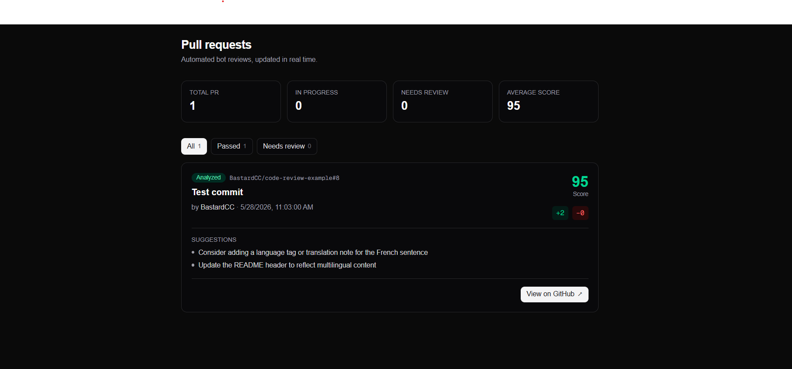
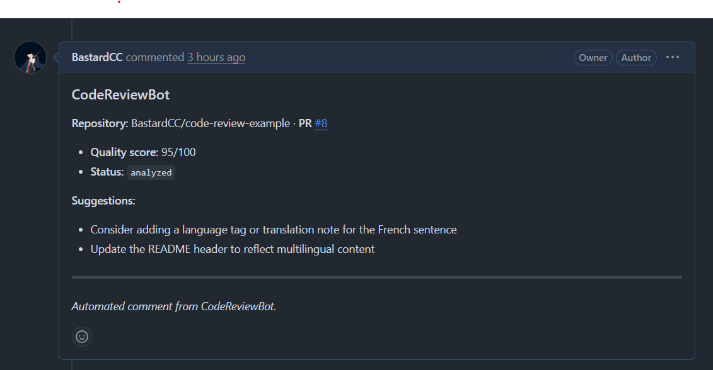

# CodeReviewBot

Automated code review assistant for GitHub pull requests. When a PR is opened or updated, the bot fetches the diff, analyzes it with an LLM, posts a review comment on GitHub, and surfaces results in a real-time admin dashboard.

## Goal

CodeReviewBot helps teams get **fast, consistent feedback** on pull requests without waiting for a human reviewer on every change. It:

- Listens to GitHub PR webhooks (`opened`, `synchronize`, `reopened`)
- Fetches changed files and builds a truncated diff for the LLM
- Produces a **quality score (0–100)** and actionable **suggestions**
- Marks each PR as **analyzed** or **needs review**
- Posts a structured comment directly on the PR
- Lets admins monitor all reviews from a **Next.js dashboard** (live via Convex)

## How it works

```
Developer opens/updates PR on GitHub
        ↓
GitHub webhook → Convex HTTP action (/github/webhook)
        ↓
Fetch PR metadata + files (GitHub API)
        ↓
LLM review via OpenRouter (Convex action)
        ↓
Save results in Convex (`prs` table)
        ↓
Post review comment on GitHub
        ↓
Admin views PRs, scores & filters on /dashboard
```

### Dashboard overview

Stats bar, filters, and PR list.



### GitHub review comment

Automated comment posted on the pull request.



## Tech stack

| Layer                  | Technology                                                                           |
| ---------------------- | ------------------------------------------------------------------------------------ |
| **Frontend**           | [Next.js 16](https://nextjs.org/) (App Router), [React 19](https://react.dev/)       |
| **Styling**            | [Tailwind CSS 4](https://tailwindcss.com/)                                           |
| **Backend & database** | [Convex](https://convex.dev/) (queries, mutations, HTTP actions, real-time sync)     |
| **LLM**                | [OpenRouter](https://openrouter.ai/) (`fetch` to chat/completions in Convex actions) |
| **Validation**         | [Zod](https://zod.dev/)                                                              |
| **GitHub**             | Webhooks (HMAC signature verification) + REST API (PRs, files, issue comments)       |
| **Language**           | TypeScript                                                                           |
| **Package manager**    | pnpm                                                                                 |

### Planned / not in MVP

- Email alerts via self-hosted [n8n](https://n8n.io/)
- Dashboard authentication
- Auto-approve simple PRs

## Getting started

### Prerequisites

- Node.js 20+
- [pnpm](https://pnpm.io/)
- A [Convex](https://convex.dev/) account
- A GitHub repo with a Personal Access Token (repo scope)
- An [OpenRouter](https://openrouter.ai/) API key

### 1. Install dependencies

```bash
pnpm install
```

### 2. Configure Convex

```bash
npx convex dev
```

Set these **Convex environment variables** (Dashboard → Settings → Environment variables):

| Variable                | Description                                        |
| ----------------------- | -------------------------------------------------- |
| `GITHUB_WEBHOOK_SECRET` | Shared secret for GitHub webhook HMAC verification |
| `GITHUB_TOKEN`          | PAT for reading PRs/files and posting comments     |
| `OPENROUTER_API_KEY`    | API key for LLM analysis in Convex actions         |
| `OPENROUTER_MODEL`      | Optional model id (default: `openrouter/free`)     |

### 3. Configure Next.js

Copy `.env.local.example` to `.env.local`:

```bash
cp .env.local.example .env.local
```

| Variable                 | Description                                      |
| ------------------------ | ------------------------------------------------ |
| `NEXT_PUBLIC_CONVEX_URL` | Convex deployment URL (from `convex dev` output) |

### 4. GitHub webhook

In your GitHub repo → **Settings → Webhooks → Add webhook**:

- **Payload URL:** `https://<your-convex-deployment>.convex.site/github/webhook`
- **Content type:** `application/json`
- **Secret:** same value as `GITHUB_WEBHOOK_SECRET`
- **Events:** Pull requests

### 5. Run locally

```bash
pnpm dev:all
```

Open [http://localhost:3000](http://localhost:3000) — you are redirected to the dashboard at `/dashboard`.
